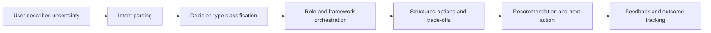

# Miaoce — AI Decision Agent

> An AI decision assistant that helps users move from vague uncertainty to structured choices and next actions.

## Overview

Miaoce is an AI-native decision assistant built around one product belief: **good decisions are not generated directly; they are clarified through structured thinking, role perspectives, and action-oriented follow-up.**

The product uses an LLM as the orchestration center to classify user intent, activate suitable thinking frameworks, call external tools or data sources when needed, and guide users toward concrete action.

## Product Problem

People often ask AI for decisions when they are actually stuck at different levels:

- They have not clarified the real question.
- They do not know which criteria matter most.
- They are emotionally biased or overloaded.
- They need multiple perspectives, not a single answer.
- They need the decision to become an executable next step.

Traditional chatbots answer too quickly. Miaoce is designed to slow down the right parts of the decision process and accelerate the parts that can be structured.

## Target Scenarios

- Lightweight everyday decisions
- Emotional and interpersonal decisions
- Career and growth decisions
- High-stakes trade-off decisions
- Decisions requiring external information or structured evaluation

## AI / Agent Mechanism

- **Intent parsing:** classify the type, complexity, and emotional load of a decision.
- **Multi-role reasoning:** introduce different perspectives to prevent one-dimensional answers.
- **Function/API orchestration:** call suitable tools or external data sources when the decision needs more context.
- **Thinking frameworks:** map different decision types to suitable frameworks.
- **Data feedback loop:** capture user choices, satisfaction, and follow-up outcomes to improve future recommendations.

## Product Flow

## My Product Role

- Defined the decision-assistant product concept and scenario taxonomy.
- Designed the multi-layer decision flow for lightweight, emotional, and high-stakes decisions.
- Explored how multi-role reasoning and tool use can make the experience more actionable.
- Framed the product around “decision as action,” not only “decision as answer.”

## Recognition

- Baidu Hackathon — **4th Place**
- Baidu Hackathon — **Dark Horse Award**

## What I Learned

- Agent products should not only answer; they should manage task state and guide action.
- The hardest product design problem is often deciding when the model should ask, reason, retrieve, or recommend.
- A useful AI decision product needs evaluation beyond answer quality: user confidence, action completion, regret reduction, and repeat usage matter.

## Next Iteration Ideas

- Add explicit confidence and uncertainty visualization.
- Add decision memory across related life/work topics.
- Add post-decision outcome tracking.
- Improve human handoff when the model detects insufficient context or high risk.
